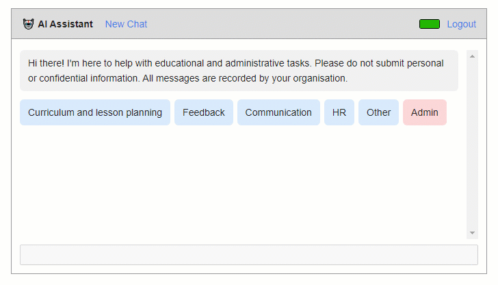

# Teacher AI

This is a web app which allows teachers to submit prompts to OpenAI models.

It is a thin wrapper around OpenAI GPT-4o with [pre-written prompts](/wwwroot/js/templates.js) to assist teachers with common educational and administrative tasks. There is also experimental support for bulk marking of student work.

## Setup

1. Create a general purpose v2 storage account in Microsoft Azure, and within it create a table called `chatlog`.
 
2. Create an Azure app registration.
    * Name - `Teacher AI`
    * Redirect URIs - `https://<app-website-domain>/signin-oidc` and `https://<app-website-domain>/auth/authorise-service-account/done`
    * Implicit grant - `ID tokens`
    * Supported account types - `Accounts in this organizational directory only`
    * Allow public client flows - `Yes`
    * Client secrets - create a new secret and save the key
    * API permissions - `Microsoft Graph - User.Read` and `Microsoft Graph - Files.ReadWrite.All`
    * Token configuration - add optional claim of type `ID`: `upn`

3. Create an OpenAI account.

4. Create an Azure App Service web app, and configure the following settings:

    * `Organisation__Name` - the name of your organisation
    * `Organisation__AdminName` - the name of the user who will administrate the Teacher AI app
    * `Organisation__AdminEmail` - the email address of the admin user
    * `Organisation__ServiceAccountEmail` - the email address of the service account which will be used to access Excel spreadsheets
    * `Organisation__AppWebsite` - the URL where this app will be hosted
    * `Organisation__Domain` - your organisation's domain name
    * `Organisation__UserCreditsPerWeek` - the number of AI credits to assign each user per week
    * `Azure__ClientId` - the client ID of your Azure app registration
    * `Azure__ClientSecret` - the client secret of your Azure app registration
    * `Azure__TenantId` - your Azure tenant ID
    * `Azure__StorageAccountName` - the name of your Azure Storage account
    * `Azure__StorageAccountKey` - the key for your Azure Storage account
    * `OpenAI__Key` - the API key for your OpenAI account
    * `OpenAI__Models__0__Type` - set to `small`
    * `OpenAI__Models__0__Name` - the name of the small OpenAI model to use, e.g. `gpt-4o-mini`
    * `OpenAI__Models__0__CostPerPromptToken` - the credit cost per prompt token for the small model
    * `OpenAI__Models__0__CostPerCompletionToken` - the credit cost per completion token for the small model
    * `OpenAI__Models__1__Type` - set to `default`
    * `OpenAI__Models__1__Name` - the name of the default OpenAI model to use, e.g. `gpt-4o`
    * `OpenAI__Models__1__CostPerPromptToken` - the credit cost per prompt token for the default model
    * `OpenAI__Models__1__CostPerCompletionToken` - the credit cost per completion token for the default model
 
5. Authorise a service account, which the app will use to access Excel spreadsheets when they are shared on OneDrive.

    * Sign in as the admin user, and navigate to `/auth/authorise-service-account`
    * When prompted to sign in with a Microsoft account, select a purpose-made service account (**not** your admin account). Consent to the required permissions.
    * You will be redirected to a page which displays the refresh token. Copy this and save it in the web app's `Azure__RefreshToken` setting.